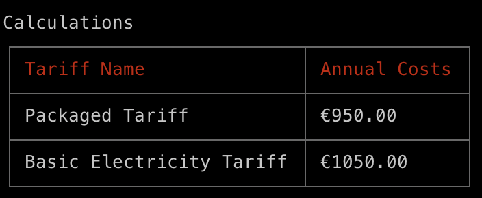

# Verivox Interview Project - Tariff Comparison Tool

This project has been developed as part of the coding challenge for a Verivox interview. It features an interactive Tariff Comparison Tool that calculates and compares electricity tariffs based on user-inputted annual consumption.

## Project Structure

- **`Tariff.ts`**: Contains the base `Tariff` class along with specific implementations for different tariffs.
- **`TariffCalculator.ts`**: Implements the logic to compute tariff costs using the classes defined in `Tariff.ts`.
- **`index.ts`**: The main script that interacts with the user to accept input through the command line and displays the results in a formatted table.

## Installation

To install the project dependencies, run the following command:

```bash
npm install
```

## Running the Tool

To run the tool interactively, follow these steps:

1. **Start the application**:
   ```bash
   npm run start
   ```
2. **Input the annual electricity consumption when prompted:**:

- The tool will ask: `Enter your annual electricity consumption in kWh`
- Enter a numerical value representing your annual electricity consumption.

3. **View the comparison results**:
   Upon entering a valid consumption value, the tool will display the annual costs for each tariff in a formatted table. Here is an example output for an input of 4500 kWh:
   

## Running Tests

The project includes automated tests to ensure the reliability of the tariff calculations and the comparison logic. To run these tests, execute:

```bash
npm run test
```
